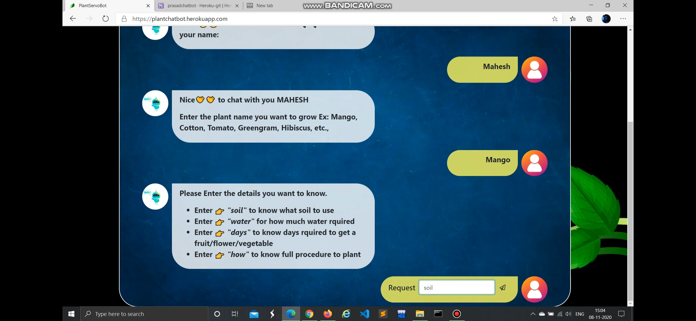

<h1>Team mates</h1>

<u1>
  <li>Chinthalapudi Satya Rama Tulasi(18PA1A0533)</li>
  <li>Chilakala Bala Mahesh(19PA1A0534)</li>
  <li>Chilakala Baby Navya(18PA1A0426)</li>
</ul>

<h1>Flask Chatbot</h1>

<h1>About FLASK</h1>
<ul>
  <li>There are a number of frameworks for Python, including Flask, Tornado, Pyramid, and Django.</li>
  <li>A <b>framework</b> is a code library that makes a developer's life easier when building reliable, scalable, and maintainable web applications by providing reusable code or extensions for common operations.</li>
  
<h1>Block Diagram of the Chatbot</h1>

<h1>Youtube Video</h1>

<h1>Flask App Developed On Heroku</h1>

https://plantchatbot.herokuapp.com/

<h1>How I made this Flask app</h1>

<h4>Creating virtual environment</h4>

<ul>
  <li><b>Step - 1</b> :- Open VScode </li>
  <li><b>Step - 2</b> :- In terminal, type "python -m venv chatbot" click Enter</li>
  <li><b>Step - 3</b> :- In terminal, type "source chatbot/Scripts/activate" click Enter</li>
  <li><b>Step - 4</b> :- In terminal, type "pip install flask" click Enter</li>
  <li><b>Step - 5</b> :- In terminal, type "pip install gunicorn" click Enter</li>
  <li><b>Step - 6</b> :- In terminal, type "git init" click Enter</li>
  <li><b>Step - 7</b> :- Outside the chatbot folder create ".gitignore" file</li>
  <li><b>Step - 8</b> :- Write "chatbot" in .gitignore</li>
  <li><b>Step - 9</b> :- Outside the chatbot folder create "Readme.md" file and write about your flask app</li>
</ul>

<h4>Coding Part</h4>

<h5>Watch the below👇 video</h5>

<h1>How to Deploy a Flask app in HEROKU</h1>

<ul>
  <li>Sign up into heroku.com</li>
  <li><b>Step - 1</b> :- In terminal type "pip freeze > requirements.txt" click Enter</li>
  <li><b>Step - 2(Optional)</b> :- In terminal type "pip install -r requirements.txt" click Enter</li>
  <li><b>Step - 3</b> :- Outside the demoenv folder create a "Procfie" file</li>
  <li><b>Step - 4</b> :- type "web: gunicorn plantservoapp.main:app" in Procfile file</li>
  <li><b>Step - 5</b> :- In terminal, type "heroku login -i" </li>
  <li><b>Step - 6</b> :- Enter email and password<li>
  <li><b>Step - 7</b> :- In source control type "initial commit" and click tick mark and goto three dots and click push</li>
  <li><b>Step - 8</b> :- Goto heroku.com and login and click on "new" and click "create new app" and put appname as "plantchatbot" and click "create app"</li>
  <li><b>Step - 9</b> :- In terminal, type "heroku git:remote -a plantchatbot"</li>
  <li><b>Step - 10</b> :- In terminal type "git push heroku master" click Enter</li>
</ul>

<h1>Tools and Computer languages that I used for this Chatbot</h1>

<ol>
  <li>VSCode for IDE</li>
  <li>Python 3.8.6</li>
  <li>HTML, CSS, Java Script</li>
  <li>Heroku</li>
  <li>Flask framework for python</li>
</ol>
