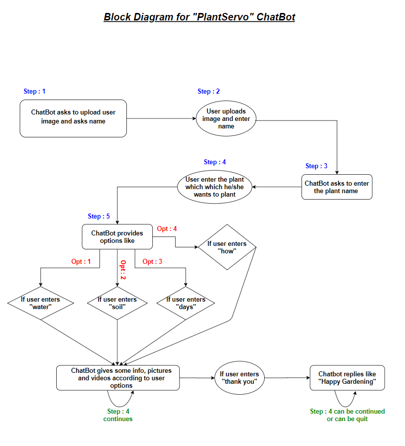
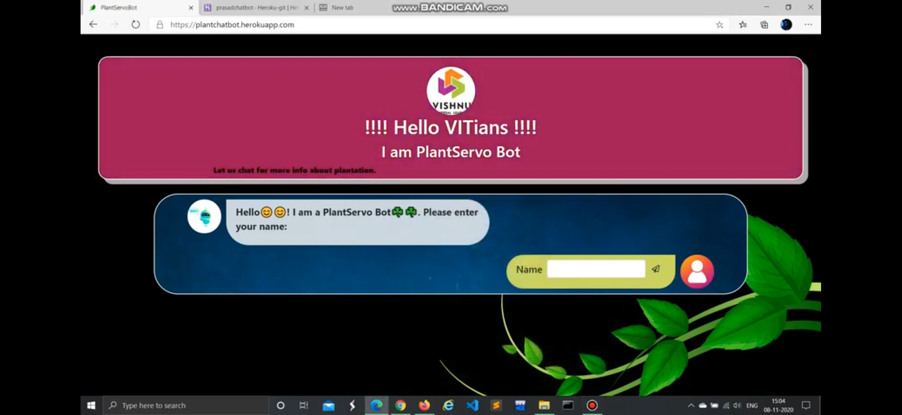

<h1>Team mates</h1>

<u1>
  <li>Chinthalapudi Satya Rama Tulasi(18PA1A0533)</li>
  <li>Chilakala Bala Mahesh(19PA1A0534)</li>
  <li>Chilakala Baby Navya(18PA1A0426)</li>
</ul>

<h1>Flask Chatbot</h1>

<h1>About FLASK</h1>
<ul>
  <li>There are a number of frameworks for Python, including Flask, Tornado, Pyramid, and Django.</li>
  <li>A <b>framework</b> is a code library that makes a developer's life easier when building reliable, scalable, and maintainable web applications by providing reusable code or extensions for common operations.</li>
  
<h1>Block Diagram of the Chatbot</h1>

<h1>Youtube Video</h1>

<h1>Flask App Developed On Heroku</h1>

https://plantchatbot.herokuapp.com/

<h1>How I made this Flask app</h1>

<h4>Creating virtual environment</h4>

<ul>
  <li><b>Step - 1</b> :- Open VScode </li>
  <li><b>Step - 2</b> :- In terminal, type "python -m venv chatbot" click Enter</li>
  <li><b>Step - 3</b> :- In terminal, type "source chatbot/Scripts/activate" click Enter</li>
  <li><b>Step - 4</b> :- In terminal, type "pip install flask" click Enter</li>
  <li><b>Step - 5</b> :- In terminal, type "pip install gunicorn" click Enter</li>
  <li><b>Step - 6</b> :- In terminal, type "git init" click Enter</li>
  <li><b>Step - 7</b> :- Outside the chatbot folder create ".gitignore" file</li>
  <li><b>Step - 8</b> :- Write "chatbot" in .gitignore</li>
  <li><b>Step - 9</b> :- Outside the chatbot folder create "Readme.md" file and write about your flask app</li>
</ul>

<h4>Coding Part</h4>

<ul>
  
  <li>Creating Flak Templates</li>
  <li>Watch the below👇 video how I coded</li>
  
  
</ul>
